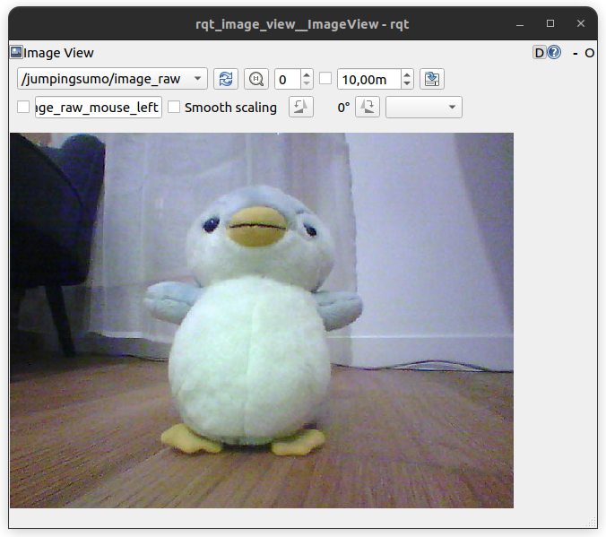
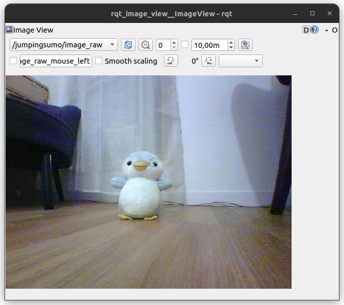

# ARDRONE ROS2

Exports ARDRONE ARSDK3 from Parrot as a ROS2 package. A node for the Jumping Sumo is provided, but more nodes are welcome in PR.

## Build the library

```bash
source /opt/ros/humble/setup.bash
rosdep install -i --from-path src --rosdistro humble -y --ignore-src
colcon build --packages-up-to ardrone_sumo --event-handlers console_direct+
```

The packages are built in steps

- The package `arsdk3` relies on CMake `ExternalProject_Add`. This command only downloads the compiled library from [ardrone-sdk-native](https://github.com/vtalpaert/ardrone-sdk-native) during the cmake install phase
- In `ardrone_sdk`, the ARSDK library needs to be already downloaded so that CMake `GLOB` will correctly list and export all the library `.so` files
- Finally `ardrone_sumo` can `<depend>ardrone_sdk</depend>` for importing headers and linking

## Jumping Sumo


ROS2 node for Jumping Sumo (and samples including Bebop)

### Features

Control the JumpingSumo drone via ROS2 topics

- Subscribe to geometry_msgs/Twist on `jumpingsumo/cmd_vel` for motion control
- Publish sensor_msgs/Image on `jumpingsumo/image_raw` for video feed
- Publish sensor_msgs/BatteryState on `jumpingsumo/battery` for battery status
- WiFi connection handling

### Usage

1. Connect to JumpingSumo's WiFi network
2. Launch the ROS2 node:

```bash
ros2 run ardrone_sumo jumping_sumo
```

To control the drone, use:

```bash
# Terminal 1
ros2 run rqt_image_view rqt_image_view /jumpingsumo/image_raw
# Terminal 2
ros2 run teleop_twist_keyboard teleop_twist_keyboard --ros-args -r cmd_vel:=/jumpingsumo/cmd_vel
```

The camera distortion is apparent for nearby objects, so calibration is needed for further use




The original sample may still be run

```bash
source install/setup.bash
JumpingSumoSample
```

To enable debug logging for detailed command information:

```bash
ros2 run ardrone_sumo jumping_sumo --ros-args --log-level jumping_sumo:=debug
```

This will show all DEBUG level messages, which include detailed command key information
